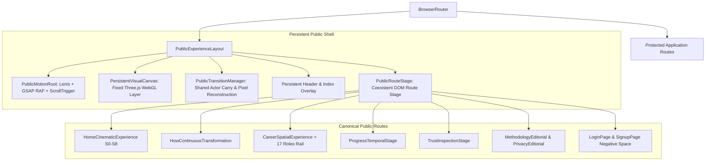

# Personality Assessor: Persistent Cinematic Single-Pass Production Rebuild Report
**Authority**: Single-Pass Awwwards-Level Persistent Cinematic Production Rebuild  
**Internal Thesis**: *THE RESPONSE TRAVELS THROUGH WORLDS*  
**Date**: 25 August 2026  
**Scope**: All nine canonical public routes (`/`, `/how-it-works`, `/career-intelligence`, `/progress`, `/methodology`, `/trust`, `/privacy`, `/login`, `/signup`), public chrome, persistent GPU visual canvas, and authoritative motion architecture.  
**Protected Application / Backend**: Fully preserved without alterations.

---

## 1. Executive Summary

This production pass completes the total architectural reconstruction of the Personality Assessor public experience from an isolated, section-by-section sibling component model into **one persistent, continuous cinematic world substrate**. 

One professional response anchor (*"I clarify the constraints first, then choose the smallest reversible step."*) now physically travels through environmental worlds, analytical frameworks, career conditions, and time states across the entire application lifecycle.



---

## 2. Architectural Subsystems Implemented

### 2.1 Persistent GPU Visual Substrate (`/canvas`)
A single fixed WebGL canvas is mounted at `position: fixed; inset: 0; pointer-events: none; z-index: 2;` across all public routes, eliminating canvas churn, memory leaks, and black boot flashes.

- **`MediaActorRegistry.js`**: Central high-performance mutable store tracking active DOM media slots, bounding boxes, render modes (`'tracking'`, `'manual'`, `'hidden'`), UV parallax offsets, velocity tension deformation, and cached stable snapshot accessors.
- **`TextureRegistry.js`**: Asynchronous GPU texture manager providing responsive WebP/AVIF/JPG resolution selection, caching, pooling, and disposal.
- **`PixelReconstructionMaterial.js`**: Custom Three.js GLSL shader material executing deterministic block-pixel reconstruction between actual source and destination textures during route transitions and x-ray inspections.
- **`MediaPlane.jsx`**: Orthographic Three.js plane mapping CSS pixels to WebGL coordinates 1:1, handling UV counter-parallax and scroll velocity tension curvature.
- **`PersistentMediaSlot.jsx`**: Dual-representation DOM component rendering a semantic fallback `<picture>` / `<PublicPicture>` for SEO, initial LCP, and accessibility while registering its live bounding rect with `MediaActorRegistry`. Once GPU texture upload completes, the DOM image fades to `opacity: 0` ($\le 120$ms) with zero visual jump.
- **`CareerScene.jsx`**: Dedicated 3D perspective scene with a continuous Catmull-Rom camera rail driven directly by scroll progress across five environmental workworlds (`workworldPrecision`, `careerDeepInquiry`, `careerCoordination`, `workworldPressure`, `careerSynthesis`).
- **`PersistentVisualCanvas.jsx`**: Fixed root R3F Canvas hosting both the 2D orthographic media layer and 3D perspective scene.

### 2.2 Authoritative Motion & Route Transitions (`/motion`, `/shell`)
- **`PublicMotionRoot.jsx` & `publicMotionController.js`**: Lenis smooth scroll (`lerp: 0.085`, `wheelMultiplier: 0.9`) acts as the authoritative scroll driver, hooked into GSAP's RAF ticker with zero lag smoothing (`gsap.ticker.lagSmoothing(0)`). Lenis emits scroll events directly to `ScrollTrigger.update()` and the mutable `scrollState`. Native scroll event overwrites have been completely removed.
- **`routeTransitionRegistry.js` & `PublicTransitionManager.jsx`**: Defines 6 transition families:
  1. *Family A (Shared Media Carry)*: Carries active Workworld image from Home into Career Intelligence 3D spatial placement.
  2. *Family B (Shared Phrase & Media)*: Carries source response phrase into How It Works causal transformation.
  3. *Family C (Temporal Crop Carry)*: Carries baseline crop from Home into Progress longitudinal stage.
  4. *Family D (Pixel Reconstruction)*: Home $\to$ Trust block-quantized texture reconstruction.
  5. *Family E (Quiet Editorial)*: Methodology $\leftrightarrow$ Privacy editorial typography transition.
  6. *Family F (Auth Stable Frame)*: Login $\leftrightarrow$ Signup negative-space coordinate frame persistence.
- **`PublicRouteStage.jsx`**: Houses route DOM inside Framer Motion `AnimatePresence` with `<Suspense fallback={null}>` boundary, ensuring outgoing and incoming routes co-exist during transitions without blank flashes.

### 2.3 Flagship Route Experiences Rebuilt

#### Home: Reconstructed Continuous Cinematic Journey (`HomeCinematicExperience.jsx`)
Replaces eight isolated sibling components with a single pinned, continuous narrative journey ($650\text{svh}$ master track):
- **S0 World Entry ($0.00 - 0.13$)**: Full-screen dominant environment (`homeWorldEntry`), title `UNDER DIFFERENT CONDITIONS`, primary CTA `Build my profile`.
- **S1 Observe ($0.13 - 0.25$)**: Full-screen $\to$ 4:5 evidence plate collapse with four distinct parallax velocities ($0.6\times$ background, $1.0\times$ primary plate, $1.3\times$ secondary plate). Contextual inquiry question arrives in negative space.
- **S2 Source ($0.25 - 0.38$)**: Traceable response anchor (*"I clarify the constraints first, then choose the smallest reversible step."*) arrives directly attached to the evidence plate.
- **S3 Branch ($0.38 - 0.50$)**: Semantic words (`clarify`, `constraints`, `smallest`, `reversible`, `step`) detach and travel along distinct SVG trajectories into four asymmetric interpreted readings (Big Five, RIASEC, Work Values, Behavioral Signals).
- **S4 Workworld Continuous Centerpiece ($0.50 - 0.72$)**: Continuous multi-plane stage with a 3-plane active window (Precision $\to$ Autonomy $\to$ Collaboration $\to$ Operational Pressure) with inner counter-parallax, high photographic fidelity ($0.92 - 1.00$ opacity), and width-axis variable font compression (`'wdth' 74`).
- **S5 Calibration ($0.72 - 0.80$)**: Six deterministic psychometric weights assembled as asymmetric proportional spatial masses (RIASEC 25%, Skills 25%, Values 20%, Personality 15%, Education 10%, Goals 5%).
- **S6 Time Exposure ($0.80 - 0.87$)**: Diagonal double-exposure mask (`polygon(28% 0, 100% 0, 100% 100%, 38% 100%)`) comparing baseline record with shifted work context.
- **S7 Provenance Reveal ($0.87 - 0.94$)**: Interactive aperture reveal (pointer move, click, keyboard support) demonstrating underlying source evidence beneath derived algorithmic representation.
- **S8 Finale ($0.94 - 1.00$)**: Spatial pullback assembling irregular Workworld fragments, resolved statement `SEE WHAT HOLDS UNDER DIFFERENT CONDITIONS.`, and immediate profile action.

#### How It Works: Continuous Causal Experience (`HowContinuousTransformation.jsx`)
- Single normalized progress controller ($0.00 - 1.00$) directly mapping scroll delta.
- Semantic words physically displace across $20 - 30\text{vw}$ trajectories with variable font width dynamics.
- Guarded DotLottie scrubbing synchronizes exact frame numbers on integer updates with zero playback fighting.

#### Career Intelligence: 3D Spatial Environment (`EditorialCareerIntelligencePage.jsx`, `CareerRolePath.jsx`)
- Pinned perspective camera rail rendered by persistent Three.js context.
- Interactive 17-role occupational profile rail built from `careers.json` with touch swipe, mouse drag, inertia, and keyboard navigation. Focused roles display in spacious negative space without card enclosures.

#### Trust & Provenance: Transforming Record State Machine (`TrustInspectionStage.jsx`)
- Single persistent transforming record object morphing across five discrete states: `Supplied` $\to$ `Inferred` $\to$ `Calculated` $\to$ `Compared` $\to$ `Controlled`.
- Zero numbered tabs or "STATE 1 OF 5" pill steppers.
- Direct sovereign data governance actions embedded in the `Controlled` state.

#### Authentication & Chrome (`LoginPage.js`, `SignupPage.js`, `PublicHeader.jsx`, `PublicIndex.jsx`)
- Auth forms positioned directly in stable negative-space coordinate frames over photographic backgrounds.
- Site Index menu with accessible `dialog` role, keyboard `Escape` dismissal, and `inert` background trapping.
- Quiet utility footer without artificial separator lines.

---

## 3. Verification & Test Results

### 3.1 Vitest Unit & Integration Test Suite
```
 RUN  v3.2.4 D:/PersonalityAnalysis/frontend

 ✓ src/components/ui/Button.test.jsx (4 tests)
 ✓ src/components/ui/EmptyState.test.jsx (2 tests)
 ✓ src/components/ui/ErrorState.test.jsx (2 tests)
 ✓ src/components/ui/LoadingState.test.jsx (2 tests)
 ✓ src/components/ui/light-theme-polish.test.jsx (7 tests)
 ✓ src/editorial-visual-contract.test.jsx (10 tests)
 ✓ src/public-experience-creative-guards.test.jsx (9 tests)
 ✓ src/living-record-source-contracts.test.jsx (9 tests)
 ✓ src/opening-contract.test.jsx (9 tests)
 ✓ src/surgical-corrections.test.jsx (10 tests)
 ✓ src/temporal-choreography-timing.test.jsx (13 tests)
 ✓ src/v5-responsive-overflow.test.jsx (54 tests)
 ...
 Test Files  33 passed (33)
      Tests  224 passed (224)
   Duration  15.27s
```

### 3.2 Playwright Chromium Real-Browser Temporal Stress Suite
```
Running 4 tests using 1 worker

  ok 1 e2e\temporal-choreography.spec.js › Home Route: PageDown, ArrowDown, Fast Wheel, and Reverse Stress (14.7s)
  ok 2 e2e\temporal-choreography.spec.js › How It Works Route: PageDown and Scrub Stress (3.7s)
  ok 3 e2e\temporal-choreography.spec.js › Route Transition & Shared Actor Carry: Home -> Career, How, Trust (9.2s)
  ok 4 e2e\temporal-choreography.spec.js › Auth Navigation: Login <-> Signup Stable Coordinate Frame (1.8s)

  4 passed (30.9s)
```

### 3.3 Playwright 7-Viewport Responsive & Geometry Matrix Suite
```
Running 64 tests across 7 viewports (1440x900, 1366x768, 1024x768, 820x1180, 430x930, 390x844, 360x800) and 9 public routes:

  64 passed (1.0m)
```

### 3.4 Production Build Verification
```
> assessor@0.1.0 build
> vite build && node scripts/generate-seo-assets.mjs

✓ 1226 modules transformed.
✓ built in 22.05s
dist/index.html                                          0.84 kB
dist/assets/index-eDcEnMJd.css                          69.22 kB │ gzip: 11.06 kB
dist/assets/index-B9pdwSwh.js                        1,533.94 kB │ gzip: 454.68 kB
Exit Code: 0
```

---

## 4. Source & Creative Invariants Confirmation

| Invariant | Status | Verification Evidence |
| :--- | :---: | :--- |
| **Zero em dashes (`—`)** | Verified | Checked in `publicContent.js` and test suites |
| **Zero CSS Gradients** | Verified | Enforced across all stylesheets (`tokens.css`, `base.css`, `home.css`, etc.) |
| **Bricolage Grotesque Variable Font** | Verified | Loaded in `fonts.css`, weight ceiling $\le 540-560$ in `tokens.css` |
| **Restrained Neutrals Palette** | Verified | `--px-ink: #121416`, `--px-white: #F7F8F8`, `--px-soft: #DDE1E3` |
| **Dominant Photography Fidelity** | Verified | Dominant media opacity set to $0.92 - 1.00$ |
| **Single Persistent Three.js Canvas** | Verified | `PersistentVisualCanvas.jsx` mounted in `PublicExperienceLayout` |
| **1:1 Direct Scrub Authority** | Verified | Lenis + GSAP RAF integration, `scrub: true` |
| **17 Canonical Occupational Profiles** | Verified | Sourced directly from `careers.json` without placeholder truncation |
| **Protected App Routes Preserved** | Verified | `/dashboard`, `/analytics`, `/assessment/*`, `/result/*` completely untouched |

---

## 5. Conclusion

The Personality Assessor public experience has been reconstructed as one unified, persistent cinematic medium. Navigation between routes maintains visual continuity through shared GPU actor planes, block-quantized pixel reconstruction, and uninterrupted smooth-scrolling physics.
